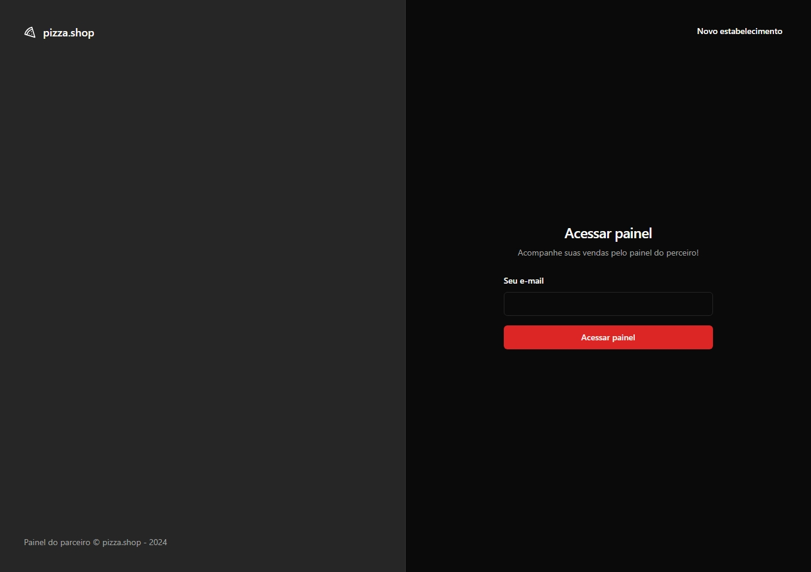
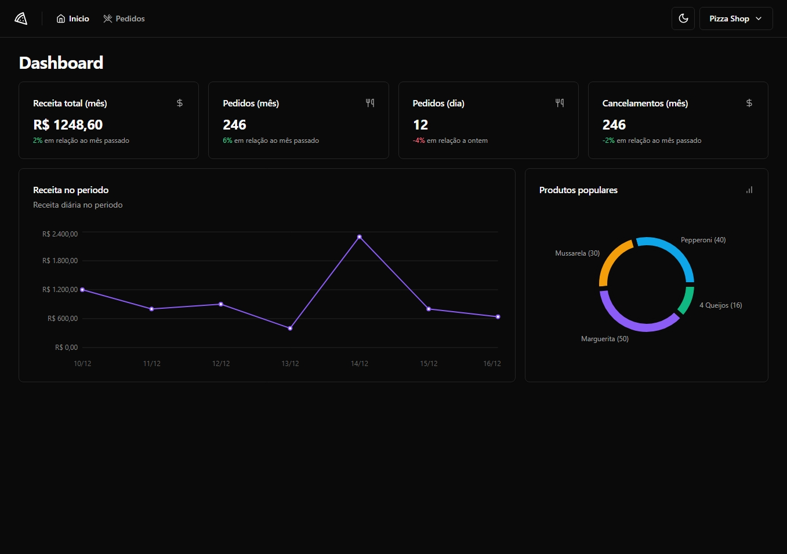
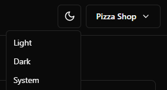

# Pizzashop

An app for order management and sales statistics.

### Page Login with magic link


### Page Admin


### Themes Dark, Ligth sync in system 


## Getting Started

### Prerequisites

- Node.js (version v20.11.0)
- npm (version 10.2.4)
- pnpm (version 8.15.2)

### Installation

1. Clone the repository.
2. Install the dependencies by running the following command:

   ```bash
   pnpm install 
   
   or

   npm install 

3. Run app 

     ```bash
   pnpm dev
   
   or

   npm run dev 
